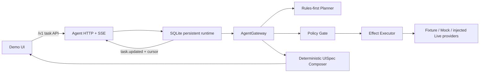

# CanvasFlow

CanvasFlow is an agent-driven generative UI workbench for turning a user goal into a reviewable, executable interface. The current competition POC implements an airport-pickup task from initial slot collection through navigation, arrival messaging, return-trip preferences, reversible cabin actions, and long-term memory confirmation.

## Architecture



- `packages/schema`: cross-package contracts for TaskState, events, API envelopes, tools, planning, and UISpec.
- `packages/agent`: deterministic Planner and reducer, rules-first Model Gateway boundary, AgentGateway, policy-gated effects, HTTP/SSE handling, idempotency, and SQLite persistence.
- `packages/tools`: validated fixture/mock Provider registry, side-effect runtimes, and live-provider interfaces.
- `packages/ui`: deterministic UISpec composition and schema-safe UI projection.
- `apps/demo`: React demo that sends task input, actions, and confirmations through the Agent HTTP API.
- `fixtures/airport-pickup`: 16 scenario contracts plus `timelines/main-flow.json`, shared by Agent, Provider, UI, and replay tests.

For single effects and successfully compensated workflows, the runtime keeps the previous task snapshot when a required provider effect fails. If a multi-effect return-trip workflow cannot fully compensate an already-applied external effect, it publishes the truthful partial state and failure receipts so the remaining work can be inspected or retried. Task updates are retained in SQLite and exposed over SSE with cursor-based `Last-Event-ID` recovery.

## Requirements

- Node.js `>=22.5 <25`
- npm
- Chromium installed through Playwright for browser E2E tests

Install the workspace dependencies:

```bash
npm ci
```

## Run Locally

### Development

```bash
AGENT_DATABASE_PATH=:memory: npm run dev
```

This starts two processes:

- Agent API: `http://127.0.0.1:8787` by default.
- Vite UI: `http://localhost:5173`, with `/v1` proxied to the Agent API.

Omit `AGENT_DATABASE_PATH=:memory:` to use the default persistent database at `.canvasflow/agent.sqlite`.

Health check:

```bash
curl http://127.0.0.1:8787/health
```

### Production-Style Preview

```bash
npm run build
AGENT_DATABASE_PATH=:memory: npm run preview
```

Preview uses one Agent server on `http://127.0.0.1:4173` to serve both `apps/demo/dist` and `/v1`.

## Agent API

The demo uses these task routes:

- `POST /v1/tasks`
- `GET /v1/tasks/:taskId`
- `POST /v1/tasks/:taskId/events`
- `POST /v1/tasks/:taskId/actions`
- `POST /v1/tasks/:taskId/confirmations/:confirmationId`
- `POST /v1/tasks/:taskId/cancel`
- `POST /v1/tasks/:taskId/reset`
- `GET /v1/tasks/:taskId/events` with `Accept: text/event-stream`

Mutation requests use client or operation idempotency keys. SSE clients receive `task.updated` snapshots and can resume with the last emitted event ID.

## Environment

| Variable | Default | Purpose |
| --- | --- | --- |
| `AGENT_HOST` | `0.0.0.0` | Agent server bind address. |
| `AGENT_PORT` | `8787` | Agent API port. The preview launcher defaults it to `4173`. |
| `AGENT_DATABASE_PATH` | `.canvasflow/agent.sqlite` | SQLite task, receipt, confirmation, and update-stream storage. Use `:memory:` for an ephemeral run. |
| `AGENT_PROVIDER_MODE` | `fixture` | Tool Provider mode: `fixture`, `mock`, or `live`. |
| `DEMO_STATIC_DIR` | unset | Static directory served by the Agent server. The preview launcher sets it to `apps/demo/dist`. |

`fixture` and `mock` use the built-in deterministic Provider registry. `live` is intentionally fail-closed: the runtime requires an explicitly injected provider factory that guarantees durable external idempotency.

Never commit credentials or `.env` files. Live Provider credentials must be supplied by the deployment environment.

## Validation

Run the required repository checks before opening or updating a pull request:

```bash
npm run lint
npm run typecheck
npm test
npm run build
```

Run the browser acceptance suite separately:

```bash
npx playwright install chromium
npm run test:e2e
```

The current Chromium suite covers two complete flows through the real Agent API:

- Complete airport pickup, execute outbound and return-trip effects, arrive home, and accept memory persistence.
- Complete the same trip and reject the arrival memory proposal.

## Demo Flow

1. Create an airport-pickup task and provide the missing passenger or flight slots.
2. Start policy-gated navigation and optionally accept a charging plan.
3. Apply flight updates, send the authorized landing message, and arrive at the airport.
4. Confirm passengers onboard, plan the route home, apply cabin preferences, and play media.
5. Use the reversible cabin action if needed.
6. Arrive home and accept or reject the long-term memory proposal.

## Known Limitations

- The shipped demo defaults to deterministic Fixture mode and includes no model key, vehicle credential, or live Provider dependency.
- `ModelGateway` is an optional public rules-first/LLM-fallback boundary, but it is not wired into the demo HTTP runtime yet. Unknown language therefore follows the deterministic Planner fallback in the shipped demo.
- A live model runtime still needs product decisions for model provenance persistence, original-versus-canonical input storage, and model-fallback metadata. Async inference must remain outside the SQLite write transaction.
- The built-in server cannot start in `live` Provider mode without an injected durable provider factory.
- Real flight, navigation, vehicle, messaging, and memory backends require deployment-specific adapters, credentials, reliability limits, and operational review.
- Fixture geometry and task facts are fictional competition data, not production navigation or aviation data.

## Contribution Flow

Normal changes branch from `origin/dev`, pass all required checks, and open a pull request into `dev`. Once CI is green and the latest Codex review reports `CODEX-REVIEW-VERDICT: PASS`, the repository workflow squash-merges the PR automatically. Only the owner promotes `dev` to `main` for a release.
