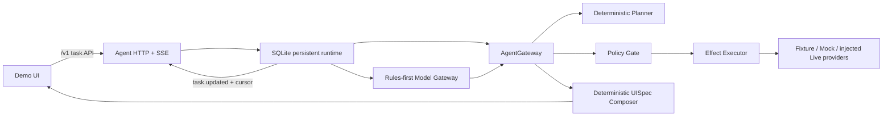

# CanvasFlow

CanvasFlow is an agent-driven generative UI workbench for turning a user goal into a reviewable, executable interface. The current competition POC implements an airport-pickup task from initial slot collection through navigation, arrival messaging, return-trip preferences, reversible cabin actions, and long-term memory confirmation.

## Architecture



- `packages/schema`: cross-package contracts for TaskState, events, API envelopes, tools, planning, and UISpec.
- `packages/agent`: deterministic Planner and reducer, rules-first Model Gateway boundary, AgentGateway, policy-gated effects, HTTP/SSE handling, idempotency, and SQLite persistence.
- `packages/tools`: validated fixture/mock Provider registry, side-effect runtimes, and live-provider interfaces.
- `packages/ui`: deterministic UISpec composition and schema-safe UI projection.
- `packages/voice`: dependency-injected voice state machine and Web Speech adapter, with no task knowledge.
- `apps/demo`: React demo that sends task input, actions, and confirmations through the Agent HTTP API.
- `fixtures/airport-pickup`: 16 scenario contracts plus `timelines/main-flow.json`, shared by Agent, Provider, UI, and replay tests.

For single effects and successfully compensated workflows, the runtime keeps the previous task snapshot when a required provider effect fails. If a multi-effect return-trip workflow cannot fully compensate an already-applied external effect, it publishes the truthful partial state and failure receipts so the remaining work can be inspected or retried. Task updates are retained in SQLite and exposed over SSE with cursor-based `Last-Event-ID` recovery.

## Requirements

- Node.js `>=22.5 <25`
- npm
- Chromium installed through Playwright for browser E2E tests

Install the workspace dependencies:

```bash
npm ci
```

## Run Locally

### Development

```bash
AGENT_DATABASE_PATH=:memory: npm run dev
```

This starts two processes:

- Agent API: `http://127.0.0.1:8787` by default.
- Vite UI: `http://localhost:5173`, with `/v1` proxied to the Agent API.

Omit `AGENT_DATABASE_PATH=:memory:` to use the default persistent database at `.canvasflow/agent.sqlite`.

Health check:

```bash
curl http://127.0.0.1:8787/health
```

### Production-Style Preview

```bash
npm run build
AGENT_DATABASE_PATH=:memory: npm run preview
```

Preview uses one Agent server on `http://127.0.0.1:4173` to serve both `apps/demo/dist` and `/v1`.

## Agent API

The demo uses these task routes:

- `POST /v1/tasks`
- `GET /v1/tasks/:taskId`
- `POST /v1/tasks/:taskId/events`
- `POST /v1/tasks/:taskId/actions`
- `POST /v1/tasks/:taskId/confirmations/:confirmationId`
- `POST /v1/tasks/:taskId/cancel`
- `POST /v1/tasks/:taskId/reset`
- `GET /v1/tasks/:taskId/events` with `Accept: text/event-stream`

Mutation requests use client or operation idempotency keys. SSE clients receive `task.updated` snapshots and can resume with the last emitted event ID.

## Environment

| Variable | Default | Purpose |
| --- | --- | --- |
| `AGENT_HOST` | `0.0.0.0` | Agent server bind address. |
| `AGENT_PORT` | `8787` | Agent API port. The preview launcher defaults it to `4173`. |
| `AGENT_DATABASE_PATH` | `.canvasflow/agent.sqlite` | SQLite task, receipt, confirmation, and update-stream storage. Use `:memory:` for an ephemeral run. |
| `AGENT_PROVIDER_MODE` | `fixture` | Tool Provider mode: `fixture`, `mock`, or `live`. |
| `AGENT_MODEL_MODE` | unset | Model planning mode. Leave unset or set `disabled` for rules-only planning; `openai-compatible` enables the validated OpenAI-compatible adapter. |
| `AGENT_MODEL_ENDPOINT` | unset | HTTPS OpenAI-compatible `/chat/completions` endpoint; required only when `AGENT_MODEL_MODE=openai-compatible`. |
| `AGENT_MODEL_ALLOWED_HOSTS` | unset | Comma-separated allowlist for the model endpoint host; required only when model planning is enabled. |
| `AGENT_MODEL_API_KEY` | unset | Deployment-injected credential for the model adapter; required only when model planning is enabled and must never be committed. |
| `AGENT_MODEL_ID` | unset | Model identifier reported as `meta.modelUsed` only when a validated model plan is applied. |
| `AGENT_MODEL_TIMEOUT_MS` | `5000` | Optional model request timeout in milliseconds, from 1 through 30000. |
| `DEMO_STATIC_DIR` | unset | Static directory served by the Agent server. The preview launcher sets it to `apps/demo/dist`. |

`fixture` and `mock` use the built-in deterministic Provider registry. `live` is intentionally fail-closed: the runtime requires an explicitly injected provider factory that guarantees durable external idempotency. Model planning is independently configured: rules remain the first path, and the model can only supply validated canonicalization for otherwise unknown supported input. Missing, failed, timed-out, low-confidence, stale, terminal, or idempotent-replay inputs do not call the model and retain the deterministic behavior. Successful model plans persist their model ID in the task snapshot and return it as `meta.modelUsed`; rules and deterministic fallbacks omit that field.

Never commit credentials or `.env` files. Live Provider credentials must be supplied by the deployment environment.

## Validation

Run the required repository checks before opening or updating a pull request:

```bash
npm run lint
npm run typecheck
npm test
npm run build
```

Run the browser acceptance suite separately:

```bash
npx playwright install chromium
npm run test:e2e
```

The current Chromium suite covers two complete flows through the real Agent API:

- Complete airport pickup, execute outbound and return-trip effects, arrive home, and accept memory persistence.
- Complete the same trip and reject the arrival memory proposal.

It also checks that a voice attempt leaves the task usable and that the text path still completes the turn when the browser exposes no speech recognition.

## Demo Flow

1. Create an airport-pickup task and provide the missing passenger or flight slots.
2. Start policy-gated navigation and optionally accept a charging plan.
3. Apply flight updates, send the authorized landing message, and arrive at the airport.
4. Confirm passengers onboard, plan the route home, apply cabin preferences, and play media.
5. Use the reversible cabin action if needed.
6. Arrive home and accept or reject the long-term memory proposal.

## Voice Input

The demo accepts spoken task input through the browser's own Web Speech API, with no server of ours and no added dependency. `packages/voice` holds a pure state machine (`idle → listening → transcribing → submitting → speaking`, plus `error`) and the peripheral adapter; neither knows anything about airport pickup.

- A recognized transcript lands in the existing task input, where it can be corrected before 发送 submits it.
- The text path closes while the microphone is capturing or its transcript is in flight, because the field still holds the previous turn's words until the voice turn hands new ones back. It reopens as soon as there is something to confirm. Typing an answer during playback barges in first, so the car stops talking instead of talking over the driver.
- Submission goes through the same Agent API call as typed text, tagged `source: 'voice'` with the engine's confidence. The frontend performs no task understanding; the spoken reply is whatever the Agent returns in `assistant`, played only when `shouldSpeak` is set.
- Pressing the microphone during playback barges in and starts a new turn.
- Every failure — no speech API, an insecure origin, a denied microphone, silence, a timeout — states what happened in the voice status line and leaves the text field usable, so a voice failure never blocks the task.
- Voice failures never mutate `TaskState`, and a rejected submission keeps the transcript in the field for a text retry.
- Wake word and local voice activity detection are out of scope for the POC.

## Known Limitations

- The shipped demo defaults to deterministic Fixture mode and includes no model key, vehicle credential, or live Provider dependency.
- With no explicit model environment configuration, the demo remains rules-only. An OpenAI-compatible adapter can be enabled by deployment configuration, but it only supports validated canonicalization of unknown airport-pickup slot input; it does not autonomously invoke tools or broaden the Agent intent contract.
- Async model inference occurs outside the SQLite write transaction. The runtime persists the configured model ID for successful model-planned create and user-input results, but intentionally does not persist raw model responses, credentials, or original-versus-canonical text mappings.
- The built-in server cannot start in `live` Provider mode without an injected durable provider factory.
- Real flight, navigation, vehicle, messaging, and memory backends require deployment-specific adapters, credentials, reliability limits, and operational review.
- Fixture geometry and task facts are fictional competition data, not production navigation or aviation data.
- Speech recognition availability and accuracy depend on the browser and its speech service. Headless Chromium exposes the API without a service behind it, so the E2E suite asserts that a voice attempt never blocks the task rather than replaying a real recognition turn.

## Third-Party Notices

[THIRD-PARTY-NOTICES.md](THIRD-PARTY-NOTICES.md) records the three third-party
packages in the browser runtime (`react`, `react-dom`, `zod`, all MIT), what
`packages/voice` owes to [cockpit-agent](https://github.com/SuperdeMan/cockpit-agent)
(Apache-2.0) and how much of it is borrowed architecture versus borrowed code, and
which evaluated projects were not adopted. Every license there was verified against
the upstream repository rather than taken from the design notes.

CanvasFlow itself carries no license: there is no `LICENSE` file and every
`package.json` is `"private": true` with no `license` field. Under default
copyright that means third parties have no permission to use or modify this code,
public readability notwithstanding. Choosing a license is the owner's call and is
listed as unresolved at the end of that file.

## Contribution Flow

Normal changes branch from `origin/dev`, pass all required checks, and open a pull request into `dev`. Once CI is green and the latest Codex review reports `CODEX-REVIEW-VERDICT: PASS`, the repository workflow squash-merges the PR automatically. Only the owner promotes `dev` to `main` for a release.
